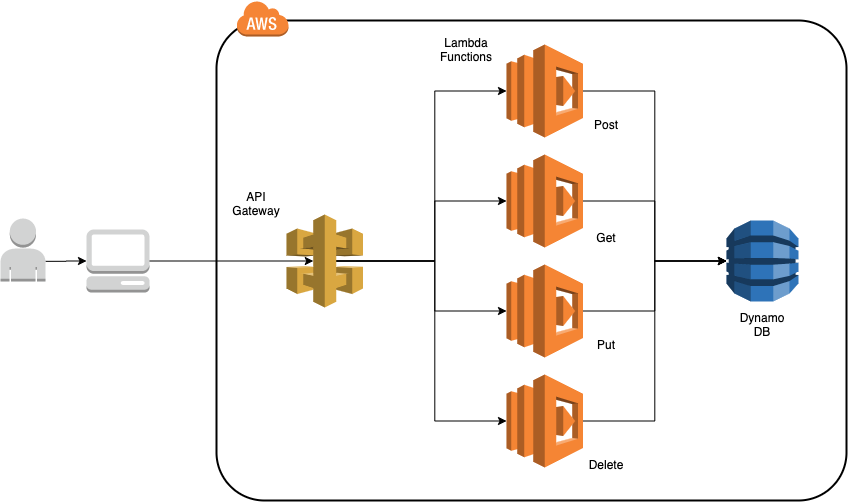

# TerraformExample
This repository contains a brief example on how to build a serverless backend infrastructure using an API Gateway + Lambda Function + Dynamo DB resources from AWS Cloud, and automate its deployment with the use of Terraform. 




In this example you will be able to perform CRUD operations in a Dynamo DB table called "People". To perform an operation, you will interact with an API Gateway that will trigger a lambda function which will take your request and perform the requested operation in the table. 

## Terraform files and Infrastructure used
The source code is divided by modules depending its purpose (AWS resource), and these modules are then invoked via a main.tf file. 

Modules: 
1. Api-gateway module
1. Dynamo db module
1. Lambda-function-post module
1. Lambda-function-get module
1. Lambda-function-delete module
1. Lambda-function-update module
1. Role module 

Each module is composed by 3 files: main.tf, variables.tf and outputs.tf. This schema is used by most of terraform developers as a standard and for good code practices. 

## Pre-requisites 
To use this repository you need to have the following tools: 
1. Terraform CLI
1. An AWS account 
1. AWS CLI

## How to use this repo 
To use this repo, after being cloned, you need to create an S3 bucket in your AWS account, and then replace the file backend.tf with the name of your new bucket: 

```
terraform {
    backend "s3" {
        bucket = "<your-bucket-name>"
        key = "terraform.tfstate"
        region = "us-east-1"
    }
}
```
After you've updated your backend.tf file with your bucket name, open a terminal, navigate to your source code, and do the following 

```
terraform init
```
This command will initialize a terraform repository and download all the dependencies needed to create your infrastructure given all the specified providers described in providers.tf file. In this example, we will only use AWS as our provider. 

Then, type: 
```
terraform apply
```
This command will show you the resources that are going to be created by terraform. The terminal will prompt you with a message regarding the resources that you are about to create. If you're good to go, type "yes" and terraform will begin to create all the resources. 

After all the resources had been created, in your AWS account, navigate to the API Gateway resource, and perform the CRUD operations you want to test. 

## Payload Examples

### Post
```
Request Body:
{
    "FirstName": "string", 
    "LastName": "string, 
    "Age": "Number", 
    "Country": "string",
    "FavoriteColor": "String"
}
```

### Get 
```
queryParams: 
userId=<uuid>&Country=<country>
```

### Delete 
```
queryParams: 
userId=<uuid>&Country=<country>
```

### Update 
```
queryParams: 
userId=<uuid>&Country=<country>

Request Body:
{
    "FirstName": "string", 
    "LastName": "string, 
    "FavoriteColor": "String"
}
```